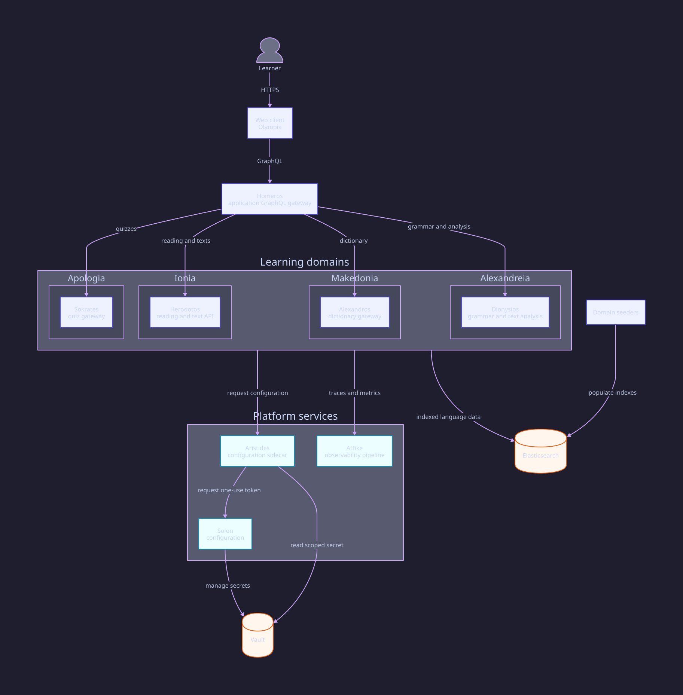
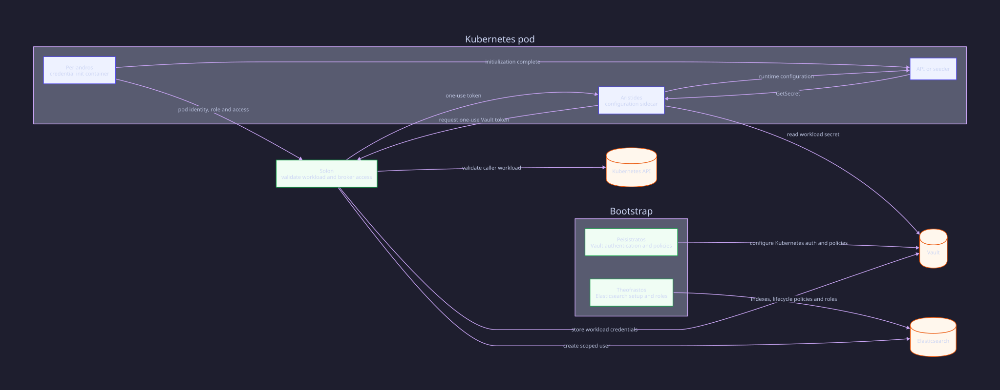
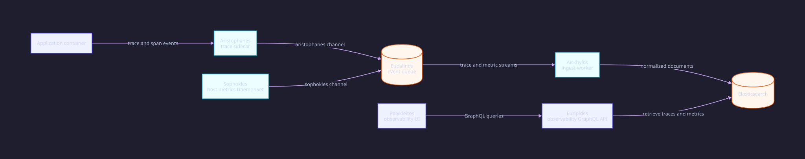

<div align="center">
  

  # Odysseia

  **An open-source journey through Ancient Greek language, literature, and history.**

  [Visit Odysseia](https://odysseia-greek.com) · [Explore the repositories](https://github.com/orgs/odysseia-greek/repositories) · [Report an issue](https://github.com/odysseia-greek/.github/issues)
</div>

Odysseia (Ὀδύσσεια) is a personal learning project built around a simple idea: studying Ancient Greek should invite exploration. It combines reading, grammar, vocabulary, quizzes, and historical context in one evolving platform.

The project is also a technical playground. Its services are written mainly in Go, run on Kubernetes, and are backed by a web interface and a set of small platform tools. Some content is in Dutch, while most of the application and documentation is in English.

> [!NOTE]
> Odysseia is a hobby project and a work in progress. Translations and interpretations may contain mistakes; corrections are welcome.

## Start exploring

The public application is available at [odysseia-greek.com](https://odysseia-greek.com). Its main learning areas include:

- **Dictionary** — look up Ancient Greek vocabulary and related forms.
- **Texts** — read source material and translations.
- **Grammar** — explore grammatical topics and examples.
- **Quizzes** — practise vocabulary and comprehension.

Services are named after figures from Greek history and literature. The name is memorable, but not always enough to explain a repository on its own; the repository description and README should be the first place to check its current responsibility.

## Project map

Odysseia is split into domain repositories rather than one monolith.

| Area | Purpose | Examples |
| --- | --- | --- |
| [Olympia](https://github.com/odysseia-greek/olympia) | Application entry point and first-line APIs | Web client, Homeros gateway, shared jobs and integration tests |
| [Alexandreia](https://github.com/odysseia-greek/alexandreia) | Grammar and text analysis | Grammar rules, attested forms, corpus evidence and analysis |
| [Makedonia](https://github.com/odysseia-greek/makedonia) | Dictionary | Dictionary search, aggregation, analytics and seeding |
| [Apologia](https://github.com/odysseia-greek/apologia) | Quizzes | Quiz gateway and specialised quiz modes |
| [Ionia](https://github.com/odysseia-greek/ionia) | Reading and texts | Guided reading, classical texts and corpus seeding |
| [Attike](https://github.com/odysseia-greek/attike) | Observability | Trace and metric collection, ingestion, querying and UI |
| [Delphi](https://github.com/odysseia-greek/delphi) | Configuration and access | Workload identity, Vault access, TLS and network policy |
| [Agora](https://github.com/odysseia-greek/agora) | Shared foundations | Go libraries, Elasticsearch and Vault clients, CRDs and queues |
| [Mykenai](https://github.com/odysseia-greek/mykenai) | Infrastructure and operations | Kubernetes environments, deployment configuration and cluster tooling |
| [Academia](https://github.com/odysseia-greek/academia) | Documentation | Long-form project and API documentation |

The repositories evolve independently. Their own READMEs and release history are authoritative when this overview differs from implementation.

## Architecture

The web client reaches **Homeros**, the application GraphQL gateway in Olympia. Homeros delegates learning work to the domain APIs: **Sokrates** for quizzes, **Herodotos** for reading and texts, **Alexandros** for the dictionary, and **Dionysios** for grammar and text analysis. Supporting services provide indexed data, configuration, access control, and observability.

[](./diagrams/architecture.svg)

### Configuration and workload access

Workloads declare a role and data scope in Kubernetes annotations. During startup, Solon validates the pod and provisions scoped access. **Aristides**, the sidecar, obtains a one-use Vault token and returns the workload's configuration. **Theofrastos** owns Elasticsearch initialization such as indexes, lifecycle policies, and role mappings.

```yaml
spec:
  template:
    metadata:
      annotations:
        odysseia-greek/role: api
        odysseia-greek/access: dictionary
```

[](./diagrams/configuration-flow.svg)

### Observability

Application containers send traces to the **Aristophanes** sidecar, while the **Sophokles** DaemonSet collects host metrics. Both publish to **Eupalinos**. **Aiskhylos** consumes those streams and indexes normalized documents in Elasticsearch; **Euripides** exposes the data through GraphQL to the **Polykleitos** UI.

[](./diagrams/observability-flow.svg)

## Development

Individual repositories contain their own build and test commands. Deployment configuration and cluster-specific development workflows belong to [Mykenai](https://github.com/odysseia-greek/mykenai).

For a first contribution:

1. Choose the repository that owns the feature or bug.
2. Read its README, contribution notes, and build files.
3. Run the repository's tests before and after your change.
4. Open a focused pull request describing the behaviour and verification.

If ownership is unclear, [open an issue in this repository](https://github.com/odysseia-greek/.github/issues) with the affected page or service.

## Diagram maintenance

Architecture diagrams live as text-based [D2](https://d2lang.com) sources in [`profile/diagrams`](./diagrams). Regenerate an SVG after editing a source file with:

```sh
d2 profile/diagrams/architecture.d2 profile/diagrams/architecture.svg
```

Run the equivalent command for each changed diagram and commit both the `.d2` source and rendered `.svg`. This keeps diagrams reviewable in diffs while allowing GitHub to display them without extra tooling.

## Mascot

The organization profile reads its mascot from [`profile/images/mascot.png`](./images/mascot.png). The new mascot can replace that file without another README change; keeping the path stable also avoids broken links in cached profile pages.

## License

Unless a repository says otherwise, consult that repository's license before reusing its code or content. This organization-profile repository is licensed under the [MIT License](../LICENSE).
