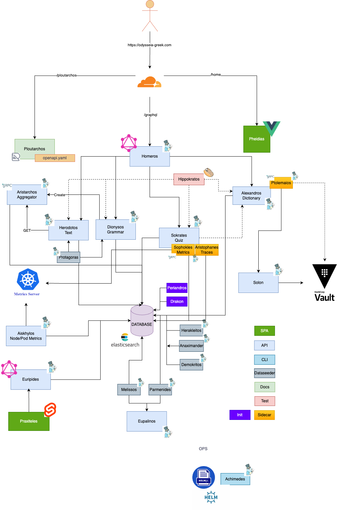
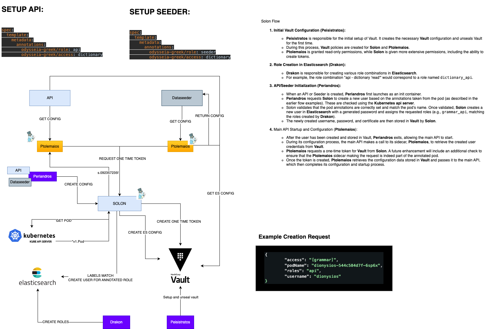

# Odysseia <!-- omit in toc -->


Welcome to Odysseia (Ὀδύσσεια): Embark on a Greek Language Odyssey

Just as the epic poem "Odysseia" by Homeros narrates the adventurous journey of Odysseus and his crew, the endeavor to learn Greek can feel like an odyssey in itself. Odysseia is a personal passion project that harmonizes a tapestry of my interests—ranging from the captivating world of ancient Greek history to the exhilarating challenge of devising innovative technical solutions.

As a dedicated hobbyist undertaking, this project reflects my personal journey, and any missteps in translation or interpretation of the text are entirely my own. The primary objective is to provide a platform for individuals to learn and practice ancient Greek, a language that echoes through time. While a portion of the content is presented in Dutch, the majority is delivered in English, fostering accessibility for a diverse audience. Accompanying this linguistic voyage is a comprehensive dictionary, meticulously crafted to facilitate seamless exploration.

However, please bear in mind that this project remains a work in progress, with many facets still under refinement. The aspiration is not only to foster language comprehension but also to delve into the captivating realm of ancient Greek history. Although this facet is a Work in Progress, my intention is to enrich the experience with historical context and narratives.

You can engage with this endeavor by exploring the Odysseia Greek project—dedicated to the pursuit of learning ancient Greek—accessible through https://odysseia-greek.com.

Beyond its role as a language learning tool, Odysseia Greek serves as a canvas to showcase technical expertise and experiment with a diverse array of technologies. By embarking on this journey with us, you're not only immersing yourself in the world of ancient language but also bearing witness to the fusion of passion and innovation.

Thank you for joining us on this voyage of discovery and learning. Your engagement and feedback contribute to shaping this odyssey, making it an ever-evolving endeavor that mirrors the spirit of exploration that courses through the ancient epics.
# Table of contents <!-- omit in toc -->
- [Technical docs](#technical-docs)
  - [Odyssey of Services: Navigating the Odyssey Greek Learning Platform](#odyssey-of-services-navigating-the-odyssey-greek-learning-platform)
  - [Solon Flow: Ensuring Configurations and Access](#solon-flow-ensuring-configurations-and-access)
  - [The Tracing Flow: Unveiling Insights through the Symphony of Data](#the-tracing-flow-unveiling-insights-through-the-symphony-of-data)
- [Attike](#attike)
  - [Aristophanes - Ἀριστοφάνης](#aristophanes---ἀριστοφάνης)
  - [Euripides - Εὐριπίδης](#euripides---εὐριπίδης)
  - [Sophokles - Σοφοκλῆς](#sophokles---σοφοκλῆς)
  - [Praxiteles - Πραξιτέλης](#praxiteles---πραξιτέλης)
- [Delphi](#delphi)
  - [Perikles - Περικλῆς](#perikles---περικλῆς)
  - [Ptolemaios - Πτολεμαῖος](#ptolemaios---πτολεμαῖος)
  - [Solon - Σόλων](#solon---σόλων)
  - [Drakon - Δράκων](#drakon---δράκων)
  - [Kleisthenes - Κλεισθένης](#kleisthenes---κλεισθένης)
  - [Peisistratos - Πεισίστρατος](#peisistratos---πεισίστρατος)
  - [Periandros - Περίανδρος](#periandros---περίανδρος)
- [Olympia](#olympia)
  - [Alexandros - Αλέξανδρος](#alexandros---αλέξανδρος)
  - [Dionysios - Διονύσιος ὁ Θρᾷξ](#dionysios---διονύσιος-ὁ-θρᾷξ)
  - [Homeros - Ὅμηρος](#homeros---Ὅμηρος)
  - [Herodotos - Ἡρόδοτος](#herodotos---ἡρόδοτος)
  - [Ploutarchos - Πλούταρχος](#ploutarchos---πλούταρχος)
  - [Sokrates - Σωκράτης](#sokrates---σωκράτης)
  - [Anaximander - Ἀναξίμανδρος](#anaximander---ἀναξίμανδρος)
  - [Anaximenes - Ἀναξιμένηςς](#anaximenes---ἀναξιμένης)
  - [Demokritos - Δημόκριτος](#demokritos---δημόκριτος)
  - [Herakleitos - Ἡράκλειτος](#herakleitos---ἡράκλειτος)
  - [Parmenides - Παρμενίδης](#parmenides---παρμενίδης)
  - [Melissos - Μέλισσος](#melissos---μέλισσος)
  - [Hippokrates - Ἱπποκράτης](#hippokrates---ἱπποκράτης)
- [Frontend](#frontend)
  - [Pheidias - Φειδίας](#pheidias---φειδίας)
- [Mykenai](#mykenai)
  - [Archimedes - Ἀρχιμήδης](#archimedes---ἀρχιμήδης)
  - [Dareios - Δαρεῖος](#dareios---δαρεῖος)
  - [Lykourgos - Λυκοῦργος](#lykourgos---λυκοῦργος)
  - [Themistokles - Θεμιστοκλῆς](#themistokles---θεμιστοκλῆς)
  - [Xerxes - Ξέρξης](#xerxes---ξέρξης)
- [Agora](#agora)
  - [Archytas - Ἀρχύτας](#archytas---Ἀρχύτας)
  - [Aristoteles - Ἀριστοτέλης](#aristoteles---Ἀριστοτέλης)
  - [Diogenes - Διογένης](#diogenes---Διογένης)
  - [Eupalinos - Εὐπαλῖνος](#Eupalinos---Εὐπαλῖνος)
  - [Plato - Πλάτων](#plato---πλάτων)
  - [Thales - Θαλῆς](#Thales---Θαλῆς)
- [Common](#common)
  - [Eratosthenes - Ἐρατοσθένης](#eratosthenes---ἐρατοσθένης)

# Technical docs

There are currently a few flows that are worth expanding upon:

## Odyssey of Services: Navigating the Odyssey Greek Learning Platform

Welcome to the Odyssey Greek Learning Platform, where ancient wisdom meets modern technology. As you embark on your journey to explore the depths of the Greek language, let us guide you through the way our services weave together to create a seamless and enriching experience.

### The Starting Point

When you access [https://odysseia-greek.com](https://odysseia-greek.com), you step onto the homepage of our application, crafted with Vue.js. From here, you can embark on your learning quest through various major modules, each named after a prominent figure in Greek history.

- **Quiz (Sokrates)**: Engage in interactive quizzes that challenge your knowledge and understanding.
- **Text (Herodotos)**: Immerse yourself in the writings of Herodotus, exploring the ancient texts.
- **Grammar (Dionysios)**: Delve into the intricate web of Greek grammar with Dionysios.
- **Dictionary (Alexandros)**: Access a treasure trove of Greek words and meanings, with more in the works.

### Seamless Navigation

As you make calls and interact with the platform, our architecture works harmoniously to provide a seamless experience. The frontend, aptly named **Pheidias**, takes your requests and forwards them to a powerful backend GraphQL proxy. This proxy connects with the necessary APIs to retrieve the information you seek. Our backend APIs are meticulously crafted using Golang, ensuring efficiency and reliability.

### The Vault of Configurations

Central to our ecosystem is **Vault**, the guardian of configurations. Every API, including our major modules and backend services, sources its configuration securely from Vault. This ensures that each component is equipped with the precise information it requires to function optimally.

### Empowering Elastic Search

Elastic Search stands as the cornerstone of our system, storing the essence of our content. The database is dynamically enriched by dedicated **Dataseeders** working tirelessly behind the scenes. Each Dataseeder exclusively populates its designated index, ensuring data integrity and organization.

### Unveiling the Unconventional

Among our Dataseeders, **Parmenides** stands out with its unique approach. This visionary Seeder places messages on a queue named **Eupalinos**. These messages are then orchestrated and processed by **Melissos**, contributing to the expansion of our dictionary.

### Initiating the Journey

To ensure a seamless start for every traveler on our platform, **Periandros** and **Drakon** work as Init Containers. They lay the foundation by creating necessary roles and provisioning user accounts for each pod.

### Guiding the Odyssey

At the helm of our platform is **Themistokles**, orchestrating and managing the Kubernetes environment. When it's time for deployment, **Archimedes**, our versatile command-line tool, steps in. Archimedes orchestrates everything from high availability setups to TLS configurations, vault management, and elastic deployments.

### Enabling TLS with Perikles

Among our heroes is **Perikles**, an ingenious service wielding an **AdmissionWebHook**. Much like the Athenian statesman, Perikles examines each service and determines if TLS is required. It then adroitly creates and updates certificates, fortifying our system's security with the same wisdom that fortified the walls of Athens.

As you navigate our platform, remember that just as the heroes of ancient Greece embarked on epic journeys, you too are on a journey of discovery and learning. Together, we explore the realms of the Greek language and culture, bridging the past and the present in a symphony of knowledge.



## Solon Flow: Ensuring Configurations and Access

Within the Odyssey Greek Learning Platform, the Solon Flow serves as a vital guardian, orchestrating the intricate dance of configurations and access across our services. This process is divided into several flows:

### Flows in Harmony

1. **API Flow**: Dedicated to APIs, this flow governs the interaction between services and the Elasticsearch database. APIs are empowered to fetch and manipulate data, but they are carefully restricted from deleting documents or indexes. Each API operates within its own designated index, ensuring separation and security.

2. **Seeder Flow**: Seeders, the diligent workers of our ecosystem, play a pivotal role in enriching our Elasticsearch database. However, they operate under strict limitations—they can populate documents, but they are barred from reading any data.

3. **Hybrid Flow**: This distinctive flow is exclusively tailored for Melissos, the visionary Seeder. Melissos bridges the gap between adding and updating documents in Elasticsearch. Due to its unique responsibilities, Melissos operates solely within this hybrid flow.

### Controlled Initiatives by Periandros

The initiation of this configuration symphony is orchestrated by **Periandros**, our Init Container. It interfaces directly with Solon to request the creation of essential configurations. This dance of creation involves establishing users in Elasticsearch and safeguarding their credentials within Vault. Notably, each pod's username is its identity, ensuring that every pod enjoys its unique access.

### Ptolemaios: The Gatekeeper

As a pod springs to life, it reaches out to its guardian **Ptolemaios**, the sidecar. Ptolemaios, in turn, communicates with Solon to secure a one-time token for accessing Vault—a token rendered useless after use. Solon's vigilance shines as it inspects Kubernetes annotations, evaluating the pod's role and the specified access level. Through annotations like:

```yaml
spec:
  template:
    metadata:
      annotations:
        odysseia-greek/role: api
        odysseia-greek/access: dictionary
```

Access roles are established, delineating the permissible actions for the pod. Once the evaluation proves successful, a token is issued, paving the way for Ptolemaios to request the configuration data from Vault.

#### The Elegance of Control

This orchestration achieves a controlled equilibrium. Solon, the master conductor, remains devoid of direct access to configurations. While it possesses the power to create and delete, the privilege of reading these configurations remains beyond its grasp. Ptolemaios, the vigilant gatekeeper, guards the path to Vault with unwavering scrutiny, ensuring secure and controlled access for each pod.

Through the Solon Flow, our platform attains a harmonious symphony of configurations and access. Just as the ancient Greeks revered the delicate balance of wisdom and governance, we uphold this principle in our modern technology, fostering a landscape of reliability and security.



## The Tracing Flow: Unveiling Insights through the Symphony of Data

Within the Odyssey Greek Learning Platform, the Tracing Flow unveils the secrets hidden within the intricate threads of operations. This flow, characterized by its straightforward elegance, paints a vivid picture of the platform's performance and interactions.

### The Role of Aristophanes

Each API is accompanied by its vigilant companion, **Aristophanes**—the sidecar that opens the doors to tracing. Aristophanes affords users the ability to initiate, augment, or cease traces, as well as to inject spans and database spans into these journeys. With these tools at hand, Aristophanes crafts traces, etching them into Elastic Search. The **traceid**, a UUID, takes the stage as the index—its unique identity preserving the story of each journey.

### Euripides: Illuminating the Path of Traces

**Euripides** emerges as the intrepid explorer, entrusted with the ability to read and comprehend traces stored in Elastic Search. Armed with this prowess, Euripides empowers the frontend, **Praxiteles**, to render these traces tangible. Through this symbiotic relationship, insights are born, journeys are mapped, and the grand narrative of the platform's performance comes to life.

### The Metrics Symphony with Sophokles

In the grand theater of Kubernetes, **Sophokles** takes the stage, meticulously collecting the symphony of metrics that tell the tale of every pod's existence. With artistry akin to the ancient playwrights, Sophokles fetches the metrics of memory and CPU usage, translating them into tangible insights. These insights illuminate the journey of each trace, enriching the narrative with the technical heartbeat of the platform.

As we traverse the Tracing Flow, we uncover a symphony of data—an interplay of actions, traces, and metrics. Just as the poets of ancient Greece unveiled the essence of human experience through words, we, too, unveil the essence of our platform through the artistry of technology. In this flow, data dances, and insights bloom, enriching our Odyssey of knowledge and understanding.


### Development flow

In order to develop locally a development flow has been setup.


### Homecluster setup

Odysseia-greek runs on a k3s platform powered by raspberry pi's.


# Repos and services

## Attike

https://github.com/odysseia-greek/attike

### Aristophanes - Ἀριστοφάνης

βρεκεκεκὲξ κοὰξ κοάξ.τούτῳ γὰρ οὐ νικήσετε.

Brekekekex koax koax. You never beat me in this play!


Aristophanes: The witty 'tracing sidecar' of our projects, just as he penned comedies that captured the essence of Athenian society, his service follows the trails of our APIs, ensuring they reach their destinations with a dash of humor.


### Euripides - Εὐριπίδης

κακῶς φρονοῦντες· ὡς τρὶς ἂν παρ’ ἀσπίδα
στῆναι θέλοιμ’ ἂν μᾶλλον ἢ τεκεῖν ἅπαξ.

How wrong they are! I would rather stand three times with a shield in battle than give birth once.


Euripides: Much like the dramatist's compelling narratives, this API, named after Euripides, exposes the intricate traces crafted by Aristophanes, providing a dramatic insight into the inner workings of our projects.

### Sophokles - Σοφοκλῆς

οὐ γὰρ θανεῖν ἔχθιστον, ἀλλʼ ὅταν θανεῖν
χρῄζων τις εἶτα μηδὲ τοῦτʼ ἔχῃ λαβεῖν.

For death is not the most odious thing; it is rather craving death, but lacking the means to die.


"Sophokles: Just as Sophocles illuminated the human condition, this service sheds light on the Kubernetes realm, bringing forth metrics that unveil the state of nodes, pods, and more, in the epic saga of system orchestration."


### Praxiteles - Πραξιτέλης

non me Praxiteles Scopasue fecit

My form Praxiteles nor Scopas hewed


Praxiteles: Our Svelte SPA artistically reveals the intricate traces and metrics of our APIs, sculpting insights into a visually engaging masterpiece of performance and efficiency.

## Delphi

https://github.com/odysseia-greek/delphi

### Perikles - Περικλῆς

τόν γε σοφώτατον οὐχ ἁμαρτήσεται σύμβουλον ἀναμείνας χρόνον.

he would yet do full well to wait for that wisest of all counsellors, Time.


Perikles: A central guardian, akin to the esteemed statesman, diligently watches over our services, preserving the sacred key and certificate pairs. Just as Perikles safeguarded Athens, this role ensures the secure realm of TLS for our projects.

### Ptolemaios - Πτολεμαῖος

Ἀπεδέχετο δʼ αὐτόν, φασί, καὶ Πτολεμαῖος ὁ Ζωτήρ. καὶ ἐγκρατὴς Μεγάρων γενόμενος ἐδίδου τε ἀργύριον αὐτῷ καὶ παρεκάλει εἰς Αἴγυπτον συμπλεῖν

Ptolemy Soter, they say, made much of him, and when he had got possession of Megara, offered him a sum of money and invited him to return with him to Egypt.


Ptolemaios: Much like the strategic ruler himself, this sidecar service reigns supreme by supplying the essential configurations from Vault, ensuring a secure and seamless passage for our projects through the intricate corridors of data.

### Solon - Σόλων

αὐτοὶ γὰρ οὐκ οἷοί τε ἦσαν αὐτὸ ποιῆσαι Ἀθηναῖοι: ὁρκίοισι γὰρ μεγάλοισι κατείχοντο δέκα ἔτεα χρήσεσθαι νόμοισι τοὺς ἄν σφι Σόλων θῆται - since the Athenians themselves could not do that, for they were bound by solemn oaths to abide for ten years by whatever laws Solon should make


Solon is most famous for his role as the great Athenian lawgiver following the reforms made by Drakon. His laws laid the foundation of what would become the Athenian Democracy.

### Drakon - Δράκων

ἐν τοίνυν τοῖς περὶ τούτων νόμοις ὁ Δράκων φοβερὸν κατασκευάζων καὶ δεινὸν τό τινʼ αὐτόχειρʼ ἄλλον ἄλλου γίγνεσθαι - Now Draco, in this group of laws, marked the terrible wickedness of homicide by banning the offender from the lustral water


Drakon is one of the ancient lawgivers in Athens.

### Kleisthenes - Κλεισθένης

ὀστρακισμός - ostracism, introduced by Kleisthenes


Fundamental to the forming of the Athenian democracy. The lawgiver Kleisthenes is tasked with laying the foundation upon which Perikles can later flourish.


### Peisistratos - Πεισίστρατος

καὶ Πεισίστρατος μὲν ἐτυράννευε Ἀθηνέων - So Pisistratus was sovereign of Athens


The first (known) tyrant of Athens

### Periandros - Περίανδρος

Περίανδρος δὲ ἦν Κυψέλου παῖς οὗτος ὁ τῷ Θρασυβούλῳ τὸ χρηστήριον μηνύσας· ἐτυράννευε δὲ ὁ Περίανδρος Κορίνθου - Periander, who disclosed the oracle's answer to Thrasybulus, was the son of Cypselus, and sovereign of Corinth


Tyrant of Corinth.

## Olympia

https://github.com/odysseia-greek/olympia

### Alexandros - Αλέξανδρος

Ου κλέπτω την νίκην - I will not steal my victory


What could I ever say in a few lines that would do justice to one of the most influential people of all time? Alexandros's energy and search for the end of the world was relentless, so too is his search for Greek words within odysseia.

### Dionysios - Διονύσιος ὁ Θρᾷξ

Γραμματική ἐστιν ἐμπειρία τῶν παρὰ ποιηταῖς τε καὶ συγγραφεῦσιν ὡς ἐπὶ τὸ πολὺ λεγομένων - Grammar is an experimental knowledge of the usages of language as generally current among poets and prose writers


Probably the first Greek Grammarian who wrote the "Τέχνη Γραμματική". Even though often called "the Thracian" he was most likely from Alexandria which was the hub for Greek learning for a long time.

### Herodotos - Ἡρόδοτος

Ἡροδότου Ἁλικαρνησσέος ἱστορίης ἀπόδεξις ἥδε - This is the display of the inquiry of Herodotos of Halikarnassos


Herodotos is often hailed as the father of history. I name he lives up to. His work (the histories) is a lively account of the histories of the Greeks and Persians and how they came into conflict. This API is responsible for passing along sentences you need to translate. They are then checked for accuracy.


### Homeros - Ὅμηρος

Αἶψα γὰρ ἐν κακότητι βροτοὶ καταγηράσκουσιν.

Hardship can age a person overnight..


Homeros: Much like the legendary poet, this GraphQL proxy weaves the threads of communication, uniting our APIs in a harmonious symphony, while enabling seamless interactions that echo the eloquent tales of the ancient epics.

### Ploutarchos - Πλούταρχος


Ploutarchos (or Plutarch) is most well known for his Parallel Lives, a series of books where he compares a well known Roman to a Greek counterpart.

### Sokrates - Σωκράτης

ἓν οἶδα ὅτι οὐδὲν οἶδα - I know one thing, that I know nothing


Sokrates (on the right) is a figure of mythical propertions. He could stare at the sky for days, weather cold in nothing but a simple cloak. Truly one of the greatest philosophers and a big influence on Plato which is why we know so much about him at all. A sokratic dialogue is a game of wits were the back and forth between Sokrates and whoever was unlucky (or lucky) to be part of the dialogue would end in frustration. Sokrates was known to question anyone until he had proven they truly knew nothing. As the API responsible for creating and asking questions he was the obvious choice.

### Anaximander - Ἀναξίμανδρος

οὐ γὰρ ἐν τοῖς αὐτοῖς ἐκεῖνος ἰχθῦς καὶ ἀνθρώπους, ἀλλ' ἐν ἰχθύσιν ἐγγενέσθαι τὸ πρῶτον ἀνθρώπους ἀποφαίνεται καὶ τραφέντας, ὥσπερ οἱ γαλεοί, καὶ γενομένους ἱκανους ἑαυτοῖς βοηθεῖν ἐκβῆναι τηνικαῦτα καὶ γῆς λαβέσθαι.

He declares that at first human beings arose in the inside of fishes, and after having been reared like sharks, and become capable of protecting themselves, they were finally cast ashore and took to land


Anaximander developed a rudimentary evolutionary explanation for biodiversity in which constant universal powers affected the lives of animals.

### Anaximenes - Ἀναξιμένης

οἷον ἡ ψυχή ἡ ἡμετέρα ἀὴρ οὖσα συγκρατεῖ ἡμᾶς, καὶ ὅλον τὸν κόσμον πνεῦμα καὶ ἀὴρ περιέχει

Just as our soul, being air, constrains us, so breath and air envelops the whole kosmos.


Anaximenes of Miletus: A pre-Socratic philosopher who proposed air as the fundamental substance underlying all existence.

### Demokritos - Δημόκριτος

νόμωι (γάρ φησι) γλυκὺ καὶ νόμωι πικρόν, νόμωι θερμόν, νόμωι ψυχρόν, νόμωι χροιή, ἐτεῆι δὲ ἄτομα καὶ κενόν

By convention sweet is sweet, bitter is bitter, hot is hot, cold is cold, color is color; but in truth there are only atoms and the void.


Most famous for his theory on atoms, everything can be broken down into smaller parts.

### Herakleitos - Ἡράκλειτος

πάντα ῥεῖ - everything flows


Herakleitos is one of the so-called pre-socratics. Philosophers that laid the foundation for the future generations. One of his most famous sayings is "No man ever steps in the same river twice".
Meaning everything constantly changes. Compare that to Parmenides. He is said to be a somber man, perhaps best reflected in the School of Athens painting where his likeness is taken from non other than Michelangelo.

### Melissos - Μέλισσος

Οὕτως οὖν ἀίδιόν ἐστι καὶ ἄπειρον καὶ ἓν καὶ ὅμοιον πᾶν.

So then it is eternal and infinite and one and all alike.


Melissus of Samos: An ancient Greek philosopher known for his contributions to Eleatic philosophy, exploring the concept of reality as a single, unchanging substance.

### Parmenides - Παρμενίδης

τό γάρ αυτο νοειν έστιν τε καί ειναι - for it is the same thinking and being


Parmenides is one of the so-called pre-socratics. Philosophers that laid the foundation for the future generations.
One of the key elements in his work is the fact that everything is one never changing thing. Therefor he is a good fit for the dataseeder. Making it like nothing every changed.

### Hippokrates - Ἱπποκράτης


ὄμνυμι Ἀπόλλωνα ἰητρὸν καὶ Ἀσκληπιὸν καὶ Ὑγείαν καὶ Πανάκειαν καὶ θεοὺς πάντας τε καὶ πάσας, ἵστορας ποιεύμενος, ἐπιτελέα ποιήσειν κατὰ δύναμιν καὶ κρίσιν ἐμὴν ὅρκον τόνδε καὶ συγγραφὴν τήνδε - I swear by Apollo Healer, by Asclepius, by Hygieia, by Panacea, and by all the gods and goddesses, making them my witnesses, that I will carry out, according to my ability and judgment, this oath and this indenture.


The most well known medical professional in history. Hippokrates houses tests to see whether the other services are in good health.


## Frontend

https://github.com/odysseia-greek/pheidias

### Pheidias - Φειδίας


Pheidias (or Phidias) is one of the great artists of the Greek world, most famous for his work on the Athenian Akropolis. An apt choice for the frontend of the app.


## Mykenai


https://github.com/odysseia-greek/mykenai

### Archimedes - Ἀρχιμήδης

εὕρηκα - I found it!


Archimedes is one of the greatest mathematicians of all time. He is also known for some nifty inventions which is why his
name has been chosen for the `ctl` tooling.

### Dareios - Δαρεῖος


Dareios is a powerful and versatile load testing repository named after the renowned Persian Great King. This repository is specifically designed to facilitate load testing for odysseia-greek.


### Lykourgos - Λυκοῦργος


Lykourgos (or Lycurgus) is a semi mythical lawmaker that laid the foundation for the Spartan society with strict rules. As a deployment abides by strict rules this is a great fit.
Ansbile and Terraform scripts can be found here.

### Themistokles - Θεμιστοκλῆς


Themistokles is argueably the greatest Greek admiral. His victory at Salamis is most well-known. As an admiral he held sway over many ships and thus over many pilots (kubernetes).
You can find all helm charts needed here.

### Xerxes - Ξέρξης


Xerxes was the Persian great king and invaded Greece during the second Greco-Persion war. He tested the Greeks with an army so great it was reported to drain rivers and shake the earth.


## Agora

https://github.com/odysseia-greek/agora

### Archytas - Ἀρχύτας

Ἀνάγκη γάρ ποτε τῷ ἀκριβεῖ λόγῳ τὰ πολλὰ τῶν ἀνθρώπων ὑποτεταχέναι - For many things among men are necessarily subjected to accurate reason.


Cache interface

### Aristoteles - Ἀριστοτέλης

Τριών δει παιδεία: φύσεως, μαθήσεως, ασκήσεως.

Education needs these three: natural endowment, study, practice.


Aristoteles: Embodying the essence of inquiry and discovery, this interface for Elasticsearch delves into the depths of data, uncovering insights and knowledge just as the philosopher Aristotle ventured to explore the realms of knowledge and understanding.


### Eupalinos - Εὐπαλῖνος

ἀρχιτέκτων δὲ τοῦ ὀρύγματος τούτου ἐγένετο Μεγαρεὺς Εὐπαλῖνος Ναυστρόφου

The designer of this work was Eupalinus son of Naustrophus, a Megarian


Eupalinos: Crafted with meticulous care, this bespoke queue embodies efficiency, orchestrating tasks with precision and grace, much like the architectural marvels created by its namesake.

### Diogenes - Διογένης

ἄνθρωπον ζητῶ

I am looking for an honest man


"Diogenes: Emulating the spirit of seeking truth and honesty, this interface engages with Vault, unearthing secrets and guarding access, much like the philosopher Diogenes pursued genuine virtue and enlightenment."

### Plato - Πλάτων

χαλεπὰ τὰ καλά

Good things are difficult to attain


Plato: The philosopher of unity and ideal forms, this package serves as a harmonizing force, encapsulating shared code that embodies the essence of perfection, fostering coherence and efficiency across our projects.


### Thales - Θαλῆς

Μέγιστον τόπος· ἄπαντα γὰρ χωρεῖ

The greatest is space, for it holds all things


Thales: Encompassing the vast expanse of Kubernetes operations, this interface mirrors the wisdom of Thales, bridging the gap between technology and understanding, orchestrating the intricate dance of containers with insightful precision.

## Common

### Eratosthenes - Ἐρατοσθένης


Holds fixtures in multiple repos. Eratosthenes was one of the librarians of Alexandria. He is most famous for calculating the circumference of the earth.
